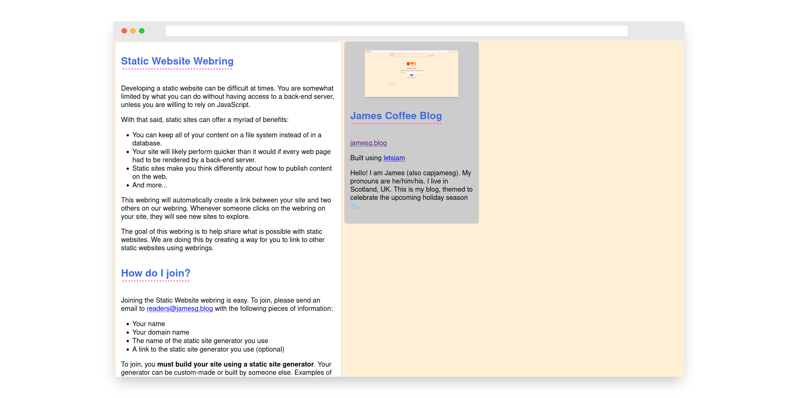

# Static Site Webring

The Static Site Webring is a collection of websites that link to each other in a ring. When you click on a webring link on one site that is part of the web ring, you will be taken to the next or previous site in the ring.

The goal of the Static Site Webring is to aggregate interesting static websites so that you can explore what other people are doing with static sites.

This repository contains the source code behind the webring. The webring is hosted at [static-site-webring.jamesg.blog](https://static-site-webring.jamesg.blog).

## Screenshot

## Setup

First, install the required dependencies for this project:

    bundle install

Next, you will need to create the database for the project. You can do so by executing this command:

    ruby seed.rb

Before you run the webring, you should populate it with at least one site. You can do so by running this command:

    ruby app.rb

This program will ask you to insert information about a website that you want to add to the webring.

Once you have added a site to the database, you are ready to run the project. You can do so by running this command:

    ruby app.rb

The application will be available at http://127.0.0.1:4567.

## Administration Scripts

This repository contains two administration scripts:

1. add_to_webring.rb: Used to add an entry to the webring.
2. validate_entries.rb: Used to ensure all websites in the webring are: (i) still online and; (ii) link to the webring. If either of these conditions are not met, the site will be removed from the webring. 

## Technologies Used

- Ruby
- Sinatra
- sqlite3
- httparty

## Licence

This project is licensed under the [MIT License](LICENSE)

## Contributors

- capjamesg